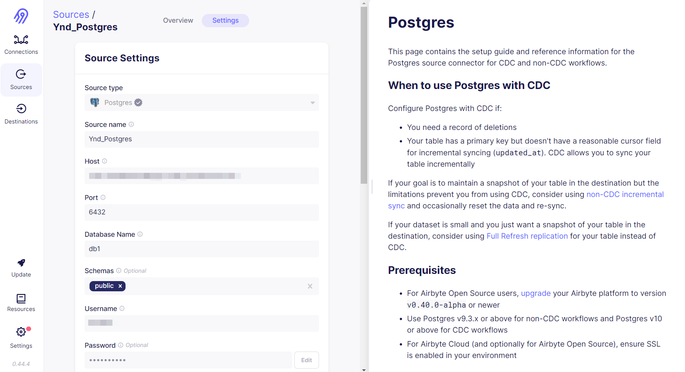
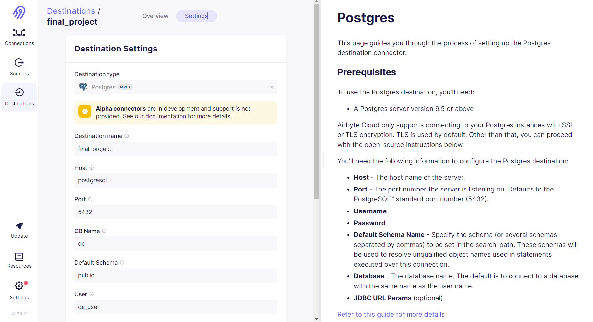
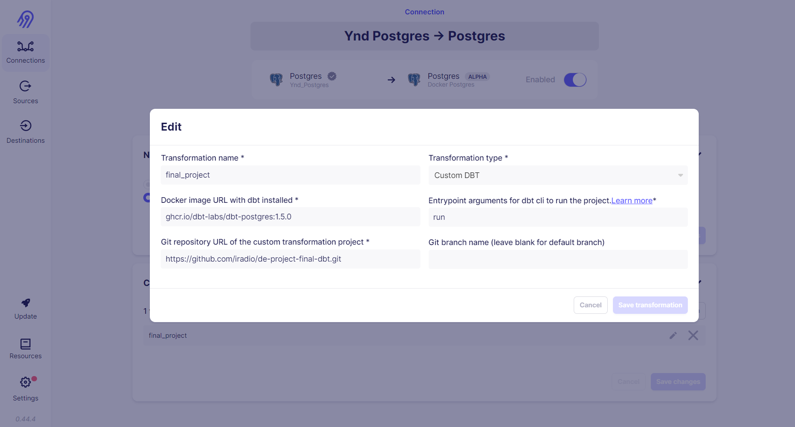
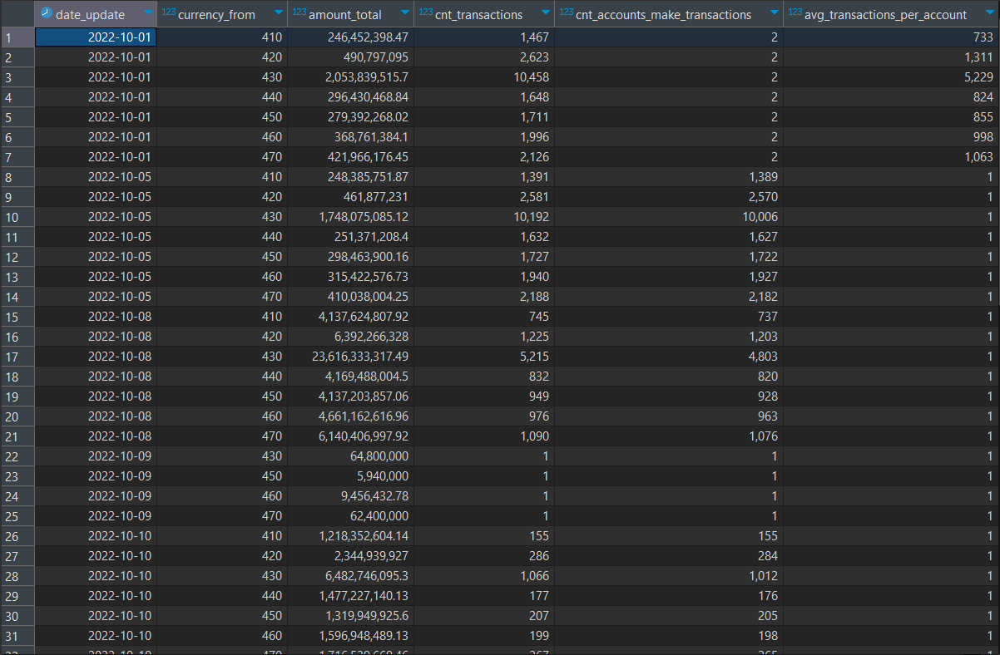

# Yandex Data Engineer course Final project
This is alternative realisation of Final project of Yandex Data Engineer course, based on ELT (not ETL) architecture.

Technical stack:
- docker
- airbyte
- dbt
- postgres
- metabase

Cosist of two repositories:
1. [ELT infrastucture](https://github.com/iradio/de-project-final-elt) 
1. [DBT project](https://github.com/iradio/de-project-final-dbt)

# Start

``` bash
git clone https://github.com/iradio/de-project-final-elt.git
git clone https://github.com/iradio/de-project-final-dbt.git
cd de-project-final-elt
docker-compose up -d
```

# Credentials
Airbyte:`de_user` / `de_pass`

# Worflow

### Extract
Set up Source in Airbyte using [UI](http://localhost:8000).  

### Load 
Set up local Postgres as Destination in Airbyte using [UI](http://localhost:8000).  

### Transform 
Stored in a separate [repository](https://github.com/iradio/de-project-final-dbt) as DBT project. Set up Transformation step in Airbyte using [UI](http://localhost:8000).


# Result
We've get the same result with [only one file](https://github.com/iradio/de-project-final-dbt/blob/main/models/cdm/cdm__global_metrics.sql) of custom code.


# Conclusions
This infrastructure can be used to extract data from the Source, load it into Destination and Transform it using `dbt`. Compared to `Airflow` based project, ELT dramatically reduces the amount of code. We've get the same result with only one file of custom code, that reduce development and support costs.